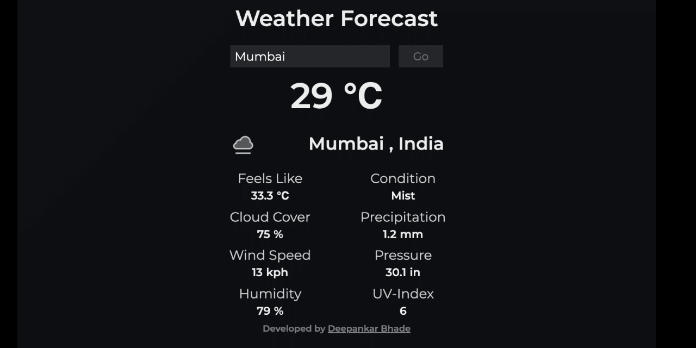
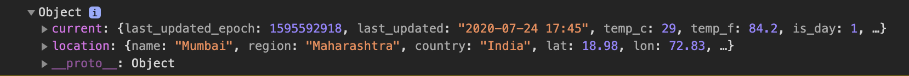

# WEATHER-DASHBOARD
An application that gives a Weather Dashboard according to the User-Input.



API used is from [Weather-API](https://www.weatherapi.com/).

## Authentication
Visit [Weather-API](https://www.weatherapi.com/) You need to signup and then you can find your API key under your account.

Authentication to the WeatherAPI.com API is provided by passing your API key as request parameter through an API .

## Key Parameter
key= \<YOUR API KEY>

## Request
Request to WeatherAPI.com API consists of base url and API method. You can make both HTTP or HTTPS request to our API.

Base URL: http://api.weatherapi.com/v1

## Tweaking the Code

```javascript
  fetch(`https://api.weatherapi.com/v1/current.json?key=${apiKey}&q=${userInput.value}`)
	.then(res => res.json())
	.then(data => {
    const dataSet = data.current;
    console.log(data);
  })
```
Make sure your Defining Your API-KEY and the User-Input  in a Variable.

```javascript
  // Init API-KEY
  const apiKey = '<YOUR_API_KEY>'
  // Init Input Text
  const userInput= document.querySelector('#user-input');
```
Now if Everything is SetUp then :

```javascript
  // Display Data
  console.log(data);
```
You should get an Object Returned in yuor Chrome Console output



Tweak the Returned Object according to the Data you need and Manipulate the DOM accordingly.

